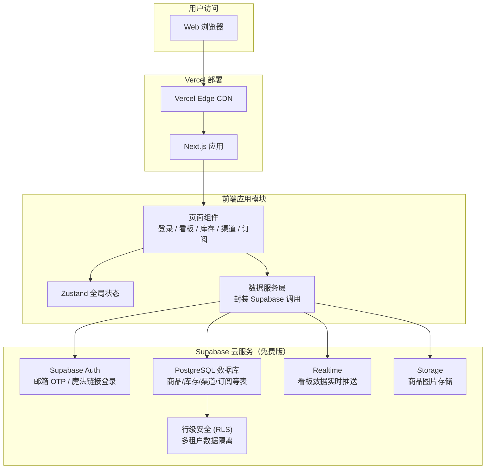
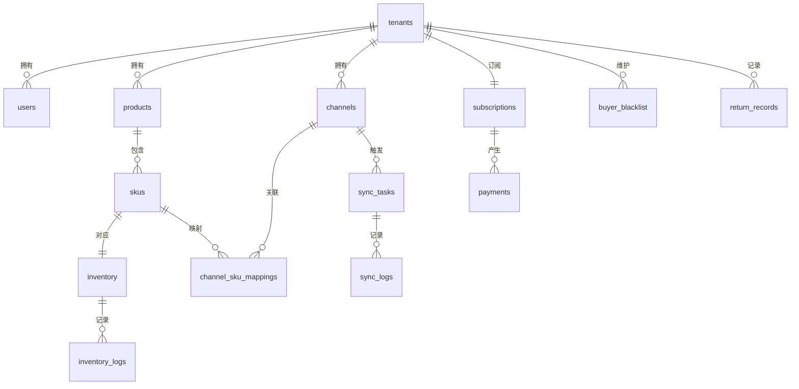
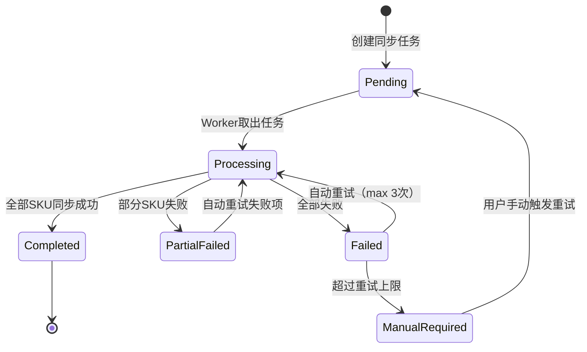
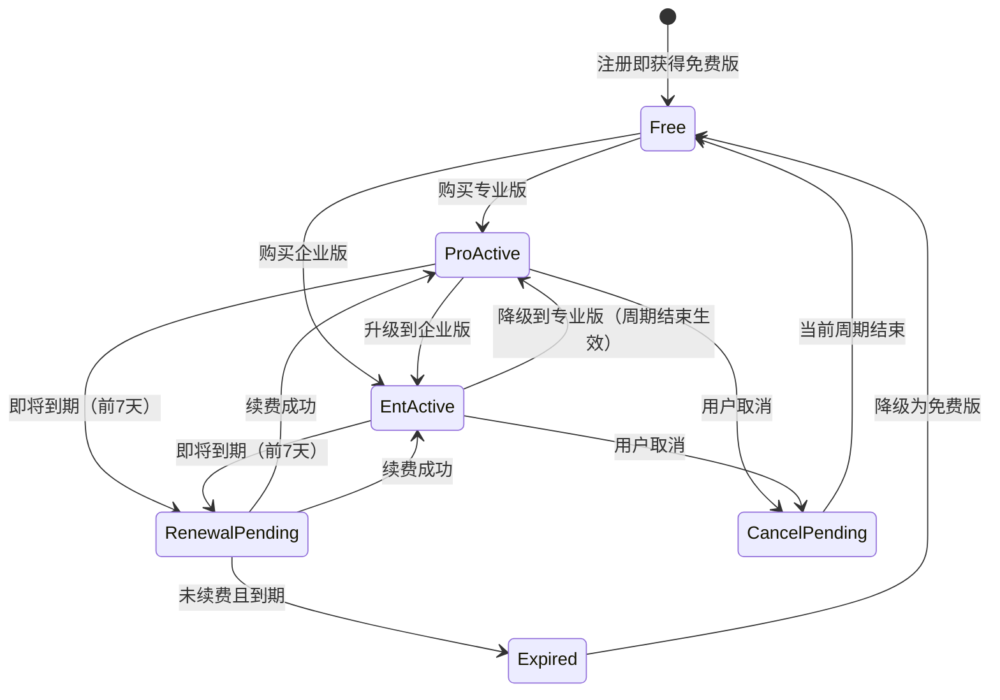
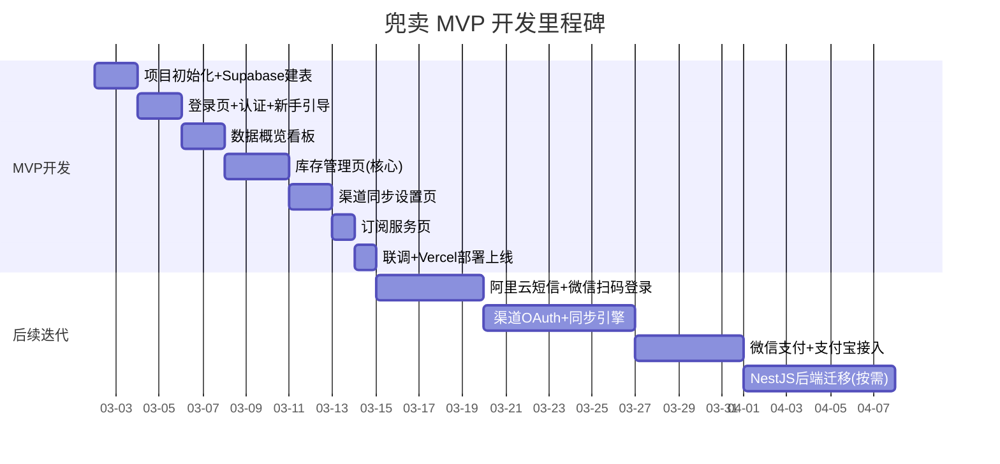

# 兜卖 - 多平台电商库存管家 SaaS 产品需求文档 (PRD)

> **文档版本**: v1.0  
> **创建日期**: 2026-02-26  
> **产品阶段**: MVP (Minimum Viable Product)  
> **文档状态**: 初稿

---

## 目录

1. [产品概述](#1-产品概述)
3. [功能需求](#3-功能需求)
4. [非功能需求](#4-非功能需求)
5. [技术架构](#5-技术架构)
6. [核心数据模型](#6-核心数据模型)
7. [UI/UX 页面设计](#7-uiux-页面设计)
8. [里程碑计划](#8-里程碑计划)
9. [成功指标](#9-成功指标)
10. [附录](#10-附录)

---

## 1. 产品概述

### 1.1 产品愿景

让中国中小电商卖家像管理一个店铺一样管理所有平台的库存，彻底告别超卖和退货损失。

### 1.2 产品定位

兜卖是一款面向中国内地多平台铺货中小卖家的轻量级库存管理 SaaS 工具。产品以**库存统一管控**为核心，以**恶意退货防护**为差异化卖点，帮助卖家在微信小程序私域和拼多多等多个电商渠道间实现库存实时联动，降低超卖风险和退货资产流失。

### 1.3 目标市场

| 维度 | 说明 |
|------|------|
| **地域** | 中国内地 |
| **目标客群** | 年营收 10 万 - 500 万元的中小电商卖家 |
| **平台覆盖 (MVP)** | 微信小程序私域、拼多多 |
| **平台覆盖 (远期)** | 淘宝/天猫、京东、抖音电商、快手电商、小红书、1688 |
| **SKU 规模** | 50 - 5000 个 SKU |
| **团队规模** | 1-10 人运营团队 |

### 1.4 商业模式

采用 **Freemium 订阅制**，设置三档订阅：

| 套餐 | 月费 | 核心权益 |
|------|------|----------|
| **免费版** | ¥0 | 50 SKU 上限、1 个渠道、基础库存管理、手动同步 |
| **专业版** | ¥49/月 | 500 SKU、3 个渠道、自动同步、库存预警、退货检测 |
| **企业版** | ¥99/月 | 无限 SKU、不限渠道、多人协作、API 接口、专属客服、自定义规则 |

年付享 8 折优惠。

### 1.5 竞品分析

| 竞品 | 定位 | 起步价 | 优势 | 劣势 |
|------|------|--------|------|------|
| **聚水潭** | 中大型卖家全链路 ERP | ¥3,600/年起 | 功能全面，覆盖供应链全流程 | 价格高昂，学习曲线陡峭，中小卖家用不到80%功能 |
| **旺店通** | 中型卖家订单管理 | ¥2,400/年起 | 订单处理能力强，平台对接全 | 库存管理非核心，退货防护缺失 |
| **马帮 ERP** | 跨境+内贸多平台管理 | ¥1,800/年起 | 跨境能力强 | 国内中小卖家场景覆盖不足 |
| **小鹅通/有赞** | 私域电商工具 | ¥4,800/年起 | 私域运营工具丰富 | 仅单平台，无跨平台库存管理 |

### 1.6 核心差异化

1. **极致轻量**：5 分钟完成注册到库存同步，无需培训即可上手，专注库存管理单一场景做深做透。
2. **恶意退货防护**：行业首创买家退货行为分析和黑名单机制，帮助卖家主动识别风险退货，降低资产损失。
3. **中小卖家友好定价**：免费版即可管理 50 个 SKU，专业版月费仅 ¥49，不到竞品十分之一的价格。
4. **私域优先**：深度支持微信小程序私域场景，填补主流 ERP 在私域库存管理上的空白。

## 3. 功能需求

### 3.1 页面 1：注册登录界面

#### 3.1.1 功能概述

提供新用户注册和已有用户登录入口，支持多种认证方式，并在首次登录后引导用户完成店铺初始化配置。

#### 3.1.2 功能清单

| 功能编号 | 功能名称 | 优先级 | 描述 |
|----------|----------|--------|------|
| F1.1 | 手机号验证码登录 | P0 | 输入手机号 → 获取短信验证码 → 验证登录/自动注册 |
| F1.2 | 微信扫码登录 | P0 | 展示微信登录二维码 → 用户手机扫码 → 授权后自动登录 |
| F1.3 | 密码登录 | P1 | 手机号 + 密码登录（注册后可设置密码） |
| F1.4 | 新手引导流程 | P0 | 首次登录触发，引导完成：填写店铺基本信息 → 授权第一个渠道 → 确认商品匹配 |
| F1.5 | 忘记密码 | P1 | 通过手机验证码重置密码 |
| F1.6 | 服务协议与隐私政策 | P0 | 注册前展示并需勾选同意 |

#### 3.1.3 详细交互逻辑

**手机号验证码登录/注册流程：**

```
用户输入手机号
  → 点击"获取验证码"
    → 前端校验手机号格式（11位数字，1开头）
    → 60秒倒计时，防止重复发送
  → 用户输入6位验证码
  → 点击"登录"
    → 后端校验验证码（5分钟有效期，错误3次锁定15分钟）
    → 手机号已注册 → 直接登录，跳转看板
    → 手机号未注册 → 自动创建账号 + 租户 → 进入新手引导
```

**新手引导流程（3步）：**

```
Step 1 - 基本信息：填写店铺名称、主营品类（下拉选择）、SKU规模区间
Step 2 - 渠道授权：选择至少1个渠道进行OAuth授权（微信小程序/拼多多）
Step 3 - 商品确认：系统自动拉取渠道商品，展示SKU匹配建议，用户确认或手动调整
→ 引导完成，进入数据概览看板
```

#### 3.1.4 业务规则

- 每个手机号对应一个租户（多店铺在一个租户下管理）。
- 验证码短信每日每个手机号上限 10 条。
- 微信扫码登录需绑定手机号（首次扫码后弹出手机号绑定弹窗）。
- 新手引导可跳过但会在看板页持续提示完成。

---

### 3.2 页面 2：数据概览看板

#### 3.2.1 功能概述

作为用户登录后的首页，以卡片式布局展示库存、销售、退货的核心数据指标，帮助卖家一眼掌握经营全局。

#### 3.2.2 功能清单

| 功能编号 | 功能名称 | 优先级 | 描述 |
|----------|----------|--------|------|
| F2.1 | 库存总览卡片 | P0 | 展示：总 SKU 数、总库存量、低库存 SKU 数、缺货 SKU 数 |
| F2.2 | 渠道销售概览 | P0 | 按渠道展示今日/近7日/近30日订单数和销售额 |
| F2.3 | 退货异常指标 | P0 | 高风险买家数量、近30日退货率趋势折线图、黑名单命中次数 |
| F2.4 | 待处理事项 | P0 | 待处理任务列表：低库存预警、同步异常、退货待审核 |
| F2.5 | 同步状态概览 | P1 | 各渠道最近一次同步时间、同步状态（正常/异常/未连接） |
| F2.6 | 快捷操作入口 | P1 | 一键跳转：手动同步、添加商品、查看预警详情 |
| F2.7 | 时间范围筛选 | P1 | 全局时间筛选器：今日、近7日、近30日、自定义范围 |

#### 3.2.3 详细交互逻辑

**看板布局（上→下，左→右）：**

```
┌─────────────────────────────────────────────────────────┐
│  顶部导航栏：Logo + 店铺名称 | 时间筛选器 | 通知铃铛 | 头像  │
├─────────────────────────────────────────────────────────┤
│  ┌──────────┐ ┌──────────┐ ┌──────────┐ ┌──────────┐   │
│  │ 总SKU数   │ │ 总库存量  │ │ 低库存预警 │ │ 缺货SKU  │   │
│  │   156    │ │  12,580  │ │   12 ⚠   │ │   3 ✖   │   │
│  └──────────┘ └──────────┘ └──────────┘ └──────────┘   │
├─────────────────────────────────────────────────────────┤
│  ┌─────────────────────┐  ┌─────────────────────┐      │
│  │   渠道销售概览        │  │   退货异常指标        │      │
│  │  [拼多多] ¥12,350   │  │  高风险买家: 5        │      │
│  │  [微信]   ¥ 3,200   │  │  退货率: 8.2% ↑      │      │
│  │  柱状图/饼图         │  │  趋势折线图           │      │
│  └─────────────────────┘  └─────────────────────┘      │
├─────────────────────────────────────────────────────────┤
│  ┌─────────────────────────────────────────────┐       │
│  │  待处理事项                                    │       │
│  │  🔴 3个SKU库存不足，需要补货                    │       │
│  │  🟡 拼多多同步异常，请检查授权                   │       │
│  │  🟡 2笔退货待审核                              │       │
│  └─────────────────────────────────────────────┘       │
└─────────────────────────────────────────────────────────┘
```

#### 3.2.4 业务规则

- 看板数据默认展示"今日"维度，用户可切换时间范围。
- 低库存预警阈值为用户在库存管理页设置的值（默认为 10）。
- 缺货定义为库存为 0 且有活跃渠道在售的 SKU。
- 退货率 = 近 N 日退货订单数 / 总订单数 × 100%。
- 高风险买家判定规则：30 日内对同一店铺退货 ≥ 3 次的买家。
- 看板数据每 30 秒自动刷新（可配置）。

---

### 3.3 页面 3：多平台库存管理

#### 3.3.1 功能概述

兜卖的核心功能页面。提供统一的商品 SKU 管理、库存编辑、预警设置、渠道分配以及恶意退货检测功能。

#### 3.3.2 功能清单

| 功能编号 | 功能名称 | 优先级 | 描述 |
|----------|----------|--------|------|
| F3.1 | 商品 SKU 列表 | P0 | 展示全部 SKU，支持搜索（名称/编码）、筛选（渠道/状态/库存区间）、排序 |
| F3.2 | 库存查看与编辑 | P0 | 查看各渠道分配库存，支持单个 SKU 直接编辑库存数量 |
| F3.3 | 批量库存操作 | P0 | 勾选多个 SKU 批量修改库存（设为固定值/增加/减少） |
| F3.4 | 库存预警设置 | P0 | 为 SKU 设置低库存预警阈值（全局默认值 + 单品自定义） |
| F3.5 | 渠道库存分配 | P0 | 设置总库存在各渠道的分配策略（按比例/按固定量/共享库存池） |
| F3.6 | 商品新增/导入 | P1 | 手动新增 SKU 或通过 CSV/Excel 批量导入 |
| F3.7 | 库存变动日志 | P1 | 记录每次库存变动的来源、时间、变动量、操作人 |
| F3.8 | 恶意退货标记 | P0 | 自动标记高频退货买家，展示退货次数和金额统计 |
| F3.9 | 买家黑名单 | P0 | 管理买家黑名单，支持手动添加和批量导入 |
| F3.10 | 商品匹配管理 | P1 | 管理不同渠道间商品 SKU 的映射关系 |

#### 3.3.3 详细交互逻辑

**SKU 列表页布局：**

```
┌──────────────────────────────────────────────────────────┐
│ [搜索框: SKU名称/编码]  [渠道▾] [库存状态▾] [排序▾] [+ 新增]  │
├──────────────────────────────────────────────────────────┤
│ ☐ | 商品图 | SKU编码 | 商品名称 | 总库存 | 拼多多 | 微信 | 预警值 | 状态 | 操作 │
│───┼────────┼────────┼─────────┼───────┼───────┼─────┼──────┼─────┼─────│
│ ☐ | [img]  | A001   | 陶瓷杯   |  120  |  80   | 40  |  10  | 正常 | 编辑 │
│ ☐ | [img]  | A002   | 收纳盒   |   8   |   5   |  3  |  10  | ⚠预警| 编辑 │
│ ☐ | [img]  | A003   | 毛巾套装 |   0   |   0   |  0  |  10  | ✖缺货| 编辑 │
├──────────────────────────────────────────────────────────┤
│ [批量操作▾]  已选 0 项                     共 156 项 | < 1 2 3 > │
└──────────────────────────────────────────────────────────┘
```

**库存编辑弹窗：**

```
┌─────── 编辑库存：陶瓷杯 (A001) ───────┐
│                                        │
│  当前总库存：120                         │
│                                        │
│  操作类型：○ 设为固定值  ○ 增加  ○ 减少   │
│  数量：[    ]                           │
│                                        │
│  渠道分配策略：                           │
│  ○ 共享库存池（各渠道共用总库存）          │
│  ○ 按比例分配  拼多多[60]% 微信[40]%     │
│  ○ 按固定量    拼多多[ 72] 微信[ 48]     │
│                                        │
│  预警阈值：[10] （低于此值触发预警）       │
│                                        │
│  变动原因：[采购入库 ▾]  备注：[      ]   │
│                                        │
│        [取消]            [确认保存]      │
└────────────────────────────────────────┘
```

**恶意退货检测面板：**

```
┌─────── 退货风险监控 ───────────────────┐
│                                        │
│  Tab: [高风险买家] [黑名单管理]          │
│                                        │
│  高风险买家列表：                        │
│  ┌──────────────────────────────────┐  │
│  │ 买家ID | 退货次数 | 退货金额 | 操作  │  │
│  │ user_a |   8次   | ¥2,340  | 加入黑名单│
│  │ user_b |   5次   | ¥ 980   | 加入黑名单│
│  └──────────────────────────────────┘  │
│                                        │
│  检测规则：30天内退货 ≥ [3] 次 → 标记     │
│                                        │
└────────────────────────────────────────┘
```

#### 3.3.4 渠道库存分配策略详解

| 策略 | 说明 | 适用场景 |
|------|------|----------|
| **共享库存池** | 所有渠道共用同一个库存数字，任一渠道出单自动扣减总库存 | SKU 少、各渠道销量差异不大 |
| **按比例分配** | 按百分比将总库存分配到各渠道，自动计算分配量 | 各渠道销量有明显差异，需按销售能力分配 |
| **按固定量分配** | 手动为每个渠道设定固定库存数量 | 需精确控制各渠道库存的场景 |

默认策略为"共享库存池"（最简单，适合新手）。

#### 3.3.5 业务规则

- 库存数量为非负整数，最小值为 0。
- 按比例分配时，各渠道比例之和必须等于 100%。
- 按固定量分配时，各渠道分配量之和不得超过总库存。
- 库存变动日志不可编辑或删除，作为审计记录永久保存。
- 高频退货判定规则可在检测面板中调整（默认 30 天 3 次）。
- 黑名单买家跨店铺共享（同一租户下所有店铺生效）。
- 免费版 SKU 上限为 50，到达上限后新增按钮置灰并提示升级。

---

### 3.4 页面 4：渠道同步设置

#### 3.4.1 功能概述

管理电商平台的店铺授权、配置库存同步策略、查看同步执行日志和异常告警。

#### 3.4.2 功能清单

| 功能编号 | 功能名称 | 优先级 | 描述 |
|----------|----------|--------|------|
| F4.1 | 渠道列表 | P0 | 展示已授权渠道及其状态（已连接/授权过期/未连接） |
| F4.2 | 添加渠道授权 | P0 | 引导用户完成 OAuth 授权（微信小程序、拼多多开放平台） |
| F4.3 | 同步策略配置 | P0 | 设置同步模式：实时同步（订单触发即同步）/ 定时同步（每 N 分钟） |
| F4.4 | 库存扣减规则 | P0 | 配置库存扣减时机：下单扣减 / 付款扣减 |
| F4.5 | 同步日志 | P0 | 展示同步任务执行记录：时间、渠道、状态、变动详情 |
| F4.6 | 异常告警 | P0 | 同步失败时触发通知（站内通知 + 微信服务号推送） |
| F4.7 | 手动同步 | P1 | 一键触发全量/增量同步 |
| F4.8 | 授权刷新 | P1 | Token 即将过期时提醒，支持一键重新授权 |

#### 3.4.3 详细交互逻辑

**渠道管理页布局：**

```
┌──────────────────────────────────────────────────────────┐
│  我的渠道                                    [+ 添加渠道]  │
├──────────────────────────────────────────────────────────┤
│  ┌─────────────────────────────────────────────────┐    │
│  │ [拼多多图标] 拼多多 - 张姐日用品专营店               │    │
│  │ 状态：🟢 已连接  |  授权到期：2026-08-15            │    │
│  │ 同步模式：实时同步  |  扣减规则：付款扣减             │    │
│  │ 最近同步：2026-02-26 14:30:22  ✅ 成功             │    │
│  │ [同步设置]  [查看日志]  [重新授权]  [断开连接]       │    │
│  └─────────────────────────────────────────────────┘    │
│                                                          │
│  ┌─────────────────────────────────────────────────┐    │
│  │ [微信图标] 微信小程序 - 张姐私域好物                 │    │
│  │ 状态：🟡 授权即将过期  |  授权到期：2026-03-05       │    │
│  │ 同步模式：定时同步(5分钟)  |  扣减规则：下单扣减      │    │
│  │ 最近同步：2026-02-26 14:25:00  ✅ 成功             │    │
│  │ [同步设置]  [查看日志]  [重新授权]  [断开连接]       │    │
│  └─────────────────────────────────────────────────┘    │
└──────────────────────────────────────────────────────────┘
```

**同步策略配置弹窗：**

```
┌─────── 同步设置：拼多多 - 张姐日用品专营店 ───────┐
│                                                   │
│  同步模式：                                        │
│  ● 实时同步（订单状态变更后立即同步库存）            │
│  ○ 定时同步  间隔：[5] 分钟                        │
│                                                   │
│  库存扣减时机：                                     │
│  ○ 下单扣减（买家下单即扣库存，取消订单自动回补）    │
│  ● 付款扣减（买家付款后扣库存，更准确但有超卖风险）  │
│                                                   │
│  退货回补策略：                                     │
│  ● 退货完成后自动回补库存                           │
│  ○ 退货后需人工确认再回补                           │
│                                                   │
│  通知设置：                                        │
│  ☑ 同步失败时发送微信通知                           │
│  ☑ 授权即将过期时提醒（提前7天）                    │
│                                                   │
│          [取消]              [保存设置]             │
└───────────────────────────────────────────────────┘
```

**同步日志列表：**

```
┌──────────────────────────────────────────────────────────┐
│  同步日志  [渠道▾] [状态▾] [时间范围]            [导出CSV] │
├──────────────────────────────────────────────────────────┤
│  时间              | 渠道   | 类型     | SKU数 | 状态     │
│  2026-02-26 14:30 | 拼多多 | 订单触发  |   3   | ✅ 成功  │
│  2026-02-26 14:25 | 微信   | 定时同步  |  156  | ✅ 成功  │
│  2026-02-26 13:10 | 拼多多 | 手动同步  |  156  | ❌ 失败  │
│  ↳ 失败原因：拼多多API返回 token_expired                   │
├──────────────────────────────────────────────────────────┤
│  共 1,234 条                                < 1 2 3 >   │
└──────────────────────────────────────────────────────────┘
```

#### 3.4.4 业务规则

- OAuth 授权 Token 有效期由各平台决定（拼多多约 12 小时刷新，微信约 2 小时刷新），系统自动刷新。
- Token 刷新失败 3 次后标记渠道为"授权异常"，停止自动同步并通知用户。
- 实时同步的延迟目标：订单状态变更后 5 秒内完成库存调整。
- 定时同步最小间隔：免费版 30 分钟，专业版 5 分钟，企业版 1 分钟。
- 同步失败时自动重试 3 次（间隔 10s/30s/60s），仍失败则记入异常日志并通知。
- 同步日志保留 90 天，超期自动归档。

---

### 3.5 页面 5：管理订阅服务

#### 3.5.1 功能概述

展示订阅套餐详情，管理订阅状态（购买、升降级、续费、取消），处理支付和发票。

#### 3.5.2 功能清单

| 功能编号 | 功能名称 | 优先级 | 描述 |
|----------|----------|--------|------|
| F5.1 | 套餐对比展示 | P0 | 以对比卡片形式展示三档套餐的功能权益差异 |
| F5.2 | 当前订阅状态 | P0 | 展示当前套餐、到期时间、已用额度（SKU数/渠道数） |
| F5.3 | 套餐购买/升级 | P0 | 选择目标套餐 → 选择周期（月/年）→ 支付 |
| F5.4 | 在线支付 | P0 | 支持微信支付、支付宝扫码支付 |
| F5.5 | 套餐降级 | P1 | 当前周期结束后生效，需确认降级影响（如超额 SKU 将被冻结） |
| F5.6 | 续费管理 | P0 | 到期前 7 天提醒续费，支持自动续费开关 |
| F5.7 | 发票管理 | P1 | 申请增值税普通发票/专用发票，管理开票记录 |
| F5.8 | 支付记录 | P1 | 查看历史支付流水 |
| F5.9 | 退款申请 | P2 | 未使用天数按比例退款（企业版专属） |

#### 3.5.3 详细交互逻辑

**套餐对比页布局：**

```
┌──────────────────────────────────────────────────────────┐
│                   选择适合您的套餐                          │
│              [月付]  [年付 (省20%)]                        │
├──────────────┬──────────────┬──────────────┬─────────────┤
│              │    免费版     │    专业版     │    企业版    │
│              │    ¥0/月     │   ¥49/月     │   ¥99/月    │
│              │              │  年付¥470/年  │  年付¥950/年 │
├──────────────┼──────────────┼──────────────┼─────────────┤
│ SKU 上限     │     50       │     500      │    无限      │
│ 渠道数       │     1        │      3       │    不限      │
│ 同步模式     │   手动同步    │   自动同步    │   自动同步   │
│ 最小同步间隔  │     -        │    5分钟     │    1分钟     │
│ 库存预警     │     ✗        │      ✓      │      ✓      │
│ 退货检测     │     ✗        │      ✓      │      ✓      │
│ 自定义规则   │     ✗        │      ✗      │      ✓      │
│ 多人协作     │   1人        │    3人       │    10人      │
│ API 接口     │     ✗        │      ✗      │      ✓      │
│ 数据导出     │     ✗        │    CSV       │  CSV+API    │
│ 客服支持     │   社区        │   在线客服    │   专属客服   │
├──────────────┼──────────────┼──────────────┼─────────────┤
│              │  [当前套餐]   │   [立即升级]  │  [立即升级]  │
└──────────────┴──────────────┴──────────────┴─────────────┘
```

**当前订阅状态卡片：**

```
┌─────── 我的订阅 ──────────────────────┐
│                                        │
│  当前套餐：专业版                       │
│  订阅周期：2026-02-01 ~ 2026-03-01     │
│  到期剩余：3 天                         │
│  自动续费：🟢 已开启                    │
│                                        │
│  使用情况：                             │
│  ├ SKU：156 / 500                      │
│  ├ 渠道：2 / 3                         │
│  └ 协作成员：2 / 3                     │
│                                        │
│  [续费] [升级套餐] [管理自动续费]       │
│                                        │
└────────────────────────────────────────┘
```

#### 3.5.4 业务规则

- 升级立即生效，按剩余天数差额计算费用。
- 降级在当前计费周期结束后生效。降级前系统检查超额资源，若 SKU 数超过目标套餐上限，需用户先删除/冻结超额 SKU。
- 自动续费默认关闭，开启后在到期前 1 天自动扣款。
- 自动续费扣款失败后再次尝试 2 次（间隔 1 天），3 次失败后降级为免费版。
- 免费版降级保留所有数据，但超额 SKU 和渠道被冻结（不再同步），不删除。
- 发票申请需在支付后 30 天内提交，支持增值税普通发票和专用发票。
- 年付套餐中途取消，未使用月份按原月费 70% 退还（企业版专属权益）。

---

## 4. 非功能需求

### 4.1 性能要求

| 指标 | 目标值 | 说明 |
|------|--------|------|
| 页面首屏加载 | < 2 秒 | 含 SSR 渲染完成时间（国内 CDN 加速） |
| API 响应时间 | P95 < 500ms | 常规 CRUD 接口 |
| 库存同步延迟 | < 5 秒 | 从订单状态变更到各渠道库存更新完成 |
| 并发支持 | 500 QPS | MVP 阶段目标 |
| 数据库查询 | P95 < 100ms | 含索引优化的常规查询 |

### 4.2 安全要求

| 维度 | 措施 |
|------|------|
| **传输安全** | 全站 HTTPS (TLS 1.2+)，API 通信强制 HTTPS |
| **数据加密** | 敏感数据（Token、支付信息）AES-256 加密存储 |
| **认证授权** | JWT Token + Refresh Token 机制，Token 有效期 2 小时 |
| **权限控制** | 基于角色的访问控制 (RBAC)：管理员 / 运营 / 仓管（企业版） |
| **接口安全** | 接口限流（IP + 用户维度）、SQL 注入防护、XSS 防护 |
| **审计日志** | 关键操作（库存修改、授权变更、支付）记录操作日志 |
| **数据隔离** | 多租户数据严格隔离，租户间不可互相访问 |

### 4.3 可用性要求

| 指标 | 目标值 |
|------|--------|
| 服务可用性 | 99.9% SLA（月度不可用时间 < 43 分钟） |
| 故障恢复时间 (RTO) | < 30 分钟 |
| 数据恢复点 (RPO) | < 5 分钟 |

### 4.4 数据备份策略

| 类型 | 频率 | 保留期 |
|------|------|--------|
| 数据库全量备份 | 每日 02:00 | 30 天 |
| 数据库增量备份 | 每小时 | 7 天 |
| 文件存储备份 | 每日 | 30 天 |
| 异地容灾 | 实时同步 | 持续 |

### 4.5 兼容性要求

| 维度 | 要求 |
|------|------|
| 浏览器 | Chrome 90+、Edge 90+、Safari 15+、Firefox 90+ |
| 屏幕 | 最低 1280×720，推荐 1920×1080，支持响应式布局 |
| 移动端 | 响应式适配移动端浏览器（非原生App，不要求完整功能） |

---

## 5. 技术架构

> **阶段说明**：本项目采用**分阶段交付策略**。MVP 阶段以 Next.js 前端 + Supabase 云数据库快速构建可演示、数据可持久化的完整产品，部署到 Vercel 公网展示。渠道 OAuth 对接、支付接入、短信服务等后续迭代。

### 5.1 技术栈选型（MVP 阶段）

| 层级 | 技术选型 | 选型理由 |
|------|----------|----------|
| **前端框架** | React 18 + Next.js 14 (App Router) | Vercel 零配置部署，路由/布局/SSR 开箱即用 |
| **UI 组件库** | Ant Design 5 | B 端 SaaS 最成熟组件库，ProTable/ProForm 大幅减少开发量 |
| **图表库** | ECharts 5 | 看板数据可视化，中文场景友好 |
| **状态管理** | Zustand | 轻量级，前端 UI 状态 + Supabase 数据缓存 |
| **数据库 + Auth** | Supabase（免费版） | 托管 PostgreSQL + 内置认证 + 实时订阅 + RLS 行级安全，前端直连无需后端 |
| **部署** | Vercel（免费版） | git push 自动构建部署，全球 CDN，零运维 |

**MVP 阶段后置的技术（后续迭代接入）：**

| 技术 | 后置理由 | 接入时机 |
|------|----------|----------|
| NestJS 后端 | Supabase 直连足够支撑 MVP 全部 CRUD 和认证 | 业务复杂度提升后 |
| Redis + Bull | 无异步任务队列需求 | 接入真实渠道同步时 |
| 阿里云短信 | Supabase Auth 支持邮箱 OTP 登录，手机短信后置 | 正式面向用户运营时 |
| 微信支付 + 支付宝 | 订阅页 UI 完整展示，支付流程用模拟演示 | 正式商业化时 |
| Docker + 阿里云 ECS | Vercel 免费版足够 MVP 演示 | 用户量增长需要国内节点时 |

### 5.2 系统架构图



### 5.3 数据服务层设计

前端通过统一的数据服务层封装所有 Supabase 调用，UI 组件不直接依赖 Supabase SDK，便于未来替换后端：

| 功能 | 实现方式 | 说明 |
|------|----------|------|
| 用户认证 | Supabase Auth（邮箱 OTP） | 邮箱一键登录，无需密码；MVP 阶段暂用邮箱替代手机号 |
| 商品/SKU CRUD | Supabase JS Client 直查 PostgreSQL | 真实数据持久化，支持搜索/筛选/排序/分页 |
| 库存增减 | Supabase RPC（数据库函数） | 库存变动通过事务保证数据一致性 |
| 渠道同步 | setTimeout 模拟 + 数据写入 Supabase | 模拟同步过程，结果写入真实数据库 |
| 退货检测 | Supabase 查询聚合 | 基于 return_records 表聚合统计高风险买家 |
| 订阅管理 | Supabase CRUD + 前端模拟支付 | 订阅状态真实存储，支付环节用模拟弹窗 |
| 数据看板 | Supabase 查询 + ECharts 渲染 | 从真实数据生成图表，Realtime 订阅自动刷新 |
| 多租户隔离 | RLS 策略绑定 `auth.uid()` → `tenant_id` | 数据库层面强制隔离，前端无法绕过 |

### 5.4 后续演进路径

```
MVP（当前）               成长期                   规模期
────────────────────     ──────────────────       ─────────────────
Next.js + Supabase  →    Next.js + NestJS API →   微服务架构
Supabase PostgreSQL →    自建 PostgreSQL 主从  →   分库分表
Supabase Auth       →    阿里云短信 + 微信登录 →   多因素认证
模拟支付            →    微信支付 / 支付宝     →   完整支付体系
模拟渠道同步        →    Bull 队列 + Worker    →   实时同步引擎
Vercel 免费版       →    Vercel Pro            →   阿里云 ECS + Docker
```

> **关键设计原则**：数据服务层的接口签名保持稳定，后续替换后端时只需修改服务层实现，无需改动 UI 组件代码。

---

## 6. 核心数据模型

### 6.1 ER 关系概览



### 6.2 表结构定义

#### tenants（租户表）

| 字段 | 类型 | 约束 | 说明 |
|------|------|------|------|
| id | UUID | PK | 租户唯一标识 |
| name | VARCHAR(100) | NOT NULL | 店铺/企业名称 |
| category | VARCHAR(50) | | 主营品类 |
| sku_scale | VARCHAR(20) | | SKU 规模区间 |
| status | ENUM | NOT NULL, DEFAULT 'active' | active / suspended / deleted |
| created_at | TIMESTAMP | NOT NULL | 创建时间 |
| updated_at | TIMESTAMP | NOT NULL | 更新时间 |

#### users（用户表）

| 字段 | 类型 | 约束 | 说明 |
|------|------|------|------|
| id | UUID | PK | 用户唯一标识 |
| tenant_id | UUID | FK → tenants.id | 所属租户 |
| phone | VARCHAR(11) | UNIQUE, NOT NULL | 手机号 |
| password_hash | VARCHAR(255) | | 密码哈希（可空，验证码登录无需密码） |
| wechat_openid | VARCHAR(64) | UNIQUE | 微信 OpenID |
| wechat_unionid | VARCHAR(64) | UNIQUE | 微信 UnionID |
| nickname | VARCHAR(50) | | 用户昵称 |
| avatar_url | VARCHAR(500) | | 头像地址 |
| role | ENUM | NOT NULL, DEFAULT 'admin' | admin / operator / warehouse |
| last_login_at | TIMESTAMP | | 最后登录时间 |
| status | ENUM | NOT NULL, DEFAULT 'active' | active / disabled |
| created_at | TIMESTAMP | NOT NULL | 创建时间 |
| updated_at | TIMESTAMP | NOT NULL | 更新时间 |

#### products（商品表）

| 字段 | 类型 | 约束 | 说明 |
|------|------|------|------|
| id | UUID | PK | 商品唯一标识 |
| tenant_id | UUID | FK → tenants.id | 所属租户 |
| name | VARCHAR(200) | NOT NULL | 商品名称 |
| image_url | VARCHAR(500) | | 商品主图 |
| category | VARCHAR(100) | | 商品品类 |
| status | ENUM | NOT NULL, DEFAULT 'active' | active / archived |
| created_at | TIMESTAMP | NOT NULL | 创建时间 |
| updated_at | TIMESTAMP | NOT NULL | 更新时间 |

#### skus（SKU 表）

| 字段 | 类型 | 约束 | 说明 |
|------|------|------|------|
| id | UUID | PK | SKU 唯一标识 |
| product_id | UUID | FK → products.id | 所属商品 |
| tenant_id | UUID | FK → tenants.id | 所属租户 |
| sku_code | VARCHAR(50) | NOT NULL | SKU 编码（租户内唯一） |
| name | VARCHAR(200) | NOT NULL | SKU 名称（含规格） |
| spec | JSONB | | 规格属性 {"颜色": "白色", "尺码": "L"} |
| price | DECIMAL(10,2) | | 参考价格 |
| cost | DECIMAL(10,2) | | 成本价 |
| status | ENUM | NOT NULL, DEFAULT 'active' | active / frozen / archived |
| created_at | TIMESTAMP | NOT NULL | 创建时间 |
| updated_at | TIMESTAMP | NOT NULL | 更新时间 |

*索引：UNIQUE(tenant_id, sku_code)*

#### inventory（库存表）

| 字段 | 类型 | 约束 | 说明 |
|------|------|------|------|
| id | UUID | PK | 主键 |
| sku_id | UUID | FK → skus.id, UNIQUE | 关联 SKU（1:1） |
| tenant_id | UUID | FK → tenants.id | 所属租户 |
| total_quantity | INTEGER | NOT NULL, DEFAULT 0 | 总库存量 |
| allocated_quantity | INTEGER | NOT NULL, DEFAULT 0 | 已分配到渠道的库存量 |
| available_quantity | INTEGER | NOT NULL, DEFAULT 0 | 可用库存（= total - allocated） |
| alert_threshold | INTEGER | DEFAULT 10 | 低库存预警阈值 |
| allocation_strategy | ENUM | DEFAULT 'shared' | shared / ratio / fixed |
| allocation_config | JSONB | | 分配配置 {"pdd": 60, "wechat": 40} |
| updated_at | TIMESTAMP | NOT NULL | 更新时间 |

#### inventory_logs（库存变动日志表）

| 字段 | 类型 | 约束 | 说明 |
|------|------|------|------|
| id | UUID | PK | 主键 |
| sku_id | UUID | FK → skus.id | 关联 SKU |
| tenant_id | UUID | FK → tenants.id | 所属租户 |
| change_type | ENUM | NOT NULL | order_deduct / return_restore / manual_adjust / sync / import |
| change_quantity | INTEGER | NOT NULL | 变动数量（正数增加，负数减少） |
| before_quantity | INTEGER | NOT NULL | 变动前库存 |
| after_quantity | INTEGER | NOT NULL | 变动后库存 |
| source_channel | VARCHAR(50) | | 来源渠道 |
| source_order_id | VARCHAR(100) | | 关联订单号 |
| operator_id | UUID | FK → users.id | 操作人（系统操作为 NULL） |
| reason | VARCHAR(200) | | 变动原因 |
| created_at | TIMESTAMP | NOT NULL | 变动时间 |

*索引：INDEX(tenant_id, sku_id, created_at DESC)*

#### channels（渠道表）

| 字段 | 类型 | 约束 | 说明 |
|------|------|------|------|
| id | UUID | PK | 主键 |
| tenant_id | UUID | FK → tenants.id | 所属租户 |
| platform | ENUM | NOT NULL | wechat_miniprogram / pinduoduo |
| shop_name | VARCHAR(200) | NOT NULL | 店铺名称 |
| shop_id | VARCHAR(100) | | 平台店铺 ID |
| access_token | TEXT | | 加密存储的访问令牌 |
| refresh_token | TEXT | | 加密存储的刷新令牌 |
| token_expires_at | TIMESTAMP | | Token 过期时间 |
| sync_mode | ENUM | DEFAULT 'realtime' | realtime / scheduled |
| sync_interval_minutes | INTEGER | DEFAULT 5 | 定时同步间隔（分钟） |
| deduct_on | ENUM | DEFAULT 'payment' | order / payment |
| return_auto_restore | BOOLEAN | DEFAULT true | 退货自动回补 |
| status | ENUM | NOT NULL, DEFAULT 'connected' | connected / expired / disconnected |
| last_sync_at | TIMESTAMP | | 最后同步时间 |
| created_at | TIMESTAMP | NOT NULL | 创建时间 |
| updated_at | TIMESTAMP | NOT NULL | 更新时间 |

#### channel_sku_mappings（渠道 SKU 映射表）

| 字段 | 类型 | 约束 | 说明 |
|------|------|------|------|
| id | UUID | PK | 主键 |
| channel_id | UUID | FK → channels.id | 关联渠道 |
| sku_id | UUID | FK → skus.id | 关联 SKU |
| tenant_id | UUID | FK → tenants.id | 所属租户 |
| platform_product_id | VARCHAR(100) | NOT NULL | 平台侧商品 ID |
| platform_sku_id | VARCHAR(100) | NOT NULL | 平台侧 SKU ID |
| channel_quantity | INTEGER | DEFAULT 0 | 该渠道分配库存量 |
| status | ENUM | DEFAULT 'active' | active / paused |
| created_at | TIMESTAMP | NOT NULL | 创建时间 |

*索引：UNIQUE(channel_id, platform_sku_id)*

#### sync_tasks（同步任务表）

| 字段 | 类型 | 约束 | 说明 |
|------|------|------|------|
| id | UUID | PK | 主键 |
| tenant_id | UUID | FK → tenants.id | 所属租户 |
| channel_id | UUID | FK → channels.id | 关联渠道 |
| type | ENUM | NOT NULL | order_triggered / scheduled / manual |
| status | ENUM | NOT NULL | pending / processing / completed / failed |
| total_skus | INTEGER | DEFAULT 0 | 涉及 SKU 数量 |
| success_count | INTEGER | DEFAULT 0 | 成功数量 |
| fail_count | INTEGER | DEFAULT 0 | 失败数量 |
| retry_count | INTEGER | DEFAULT 0 | 已重试次数 |
| max_retries | INTEGER | DEFAULT 3 | 最大重试次数 |
| error_message | TEXT | | 错误信息 |
| started_at | TIMESTAMP | | 开始处理时间 |
| completed_at | TIMESTAMP | | 完成时间 |
| created_at | TIMESTAMP | NOT NULL | 创建时间 |

#### sync_logs（同步日志表）

| 字段 | 类型 | 约束 | 说明 |
|------|------|------|------|
| id | UUID | PK | 主键 |
| sync_task_id | UUID | FK → sync_tasks.id | 关联同步任务 |
| tenant_id | UUID | FK → tenants.id | 所属租户 |
| sku_id | UUID | FK → skus.id | 关联 SKU |
| channel_id | UUID | FK → channels.id | 关联渠道 |
| action | ENUM | NOT NULL | update_stock / deduct / restore |
| before_quantity | INTEGER | | 变动前数量 |
| after_quantity | INTEGER | | 变动后数量 |
| platform_response | JSONB | | 平台 API 原始响应 |
| status | ENUM | NOT NULL | success / failed |
| error_message | TEXT | | 错误信息 |
| created_at | TIMESTAMP | NOT NULL | 创建时间 |

#### return_records（退货记录表）

| 字段 | 类型 | 约束 | 说明 |
|------|------|------|------|
| id | UUID | PK | 主键 |
| tenant_id | UUID | FK → tenants.id | 所属租户 |
| channel_id | UUID | FK → channels.id | 关联渠道 |
| order_id | VARCHAR(100) | NOT NULL | 平台订单号 |
| buyer_id | VARCHAR(100) | NOT NULL | 买家 ID |
| buyer_name | VARCHAR(100) | | 买家昵称 |
| sku_id | UUID | FK → skus.id | 关联 SKU |
| quantity | INTEGER | NOT NULL | 退货数量 |
| refund_amount | DECIMAL(10,2) | | 退款金额 |
| return_type | ENUM | NOT NULL | refund_only / return_and_refund |
| risk_level | ENUM | DEFAULT 'normal' | normal / medium / high |
| status | ENUM | NOT NULL | pending / approved / rejected / completed |
| created_at | TIMESTAMP | NOT NULL | 创建时间 |

*索引：INDEX(tenant_id, buyer_id, created_at DESC)*

#### buyer_blacklist（买家黑名单表）

| 字段 | 类型 | 约束 | 说明 |
|------|------|------|------|
| id | UUID | PK | 主键 |
| tenant_id | UUID | FK → tenants.id | 所属租户 |
| buyer_id | VARCHAR(100) | NOT NULL | 买家 ID |
| buyer_name | VARCHAR(100) | | 买家昵称 |
| platform | VARCHAR(50) | NOT NULL | 来源平台 |
| reason | VARCHAR(500) | | 拉黑原因 |
| return_count | INTEGER | DEFAULT 0 | 累计退货次数 |
| return_amount | DECIMAL(10,2) | DEFAULT 0 | 累计退货金额 |
| added_by | UUID | FK → users.id | 操作人（自动标记为 NULL） |
| status | ENUM | DEFAULT 'active' | active / removed |
| created_at | TIMESTAMP | NOT NULL | 加入时间 |

*索引：UNIQUE(tenant_id, buyer_id, platform)*

#### subscriptions（订阅表）

| 字段 | 类型 | 约束 | 说明 |
|------|------|------|------|
| id | UUID | PK | 主键 |
| tenant_id | UUID | FK → tenants.id, UNIQUE | 所属租户 |
| plan | ENUM | NOT NULL, DEFAULT 'free' | free / pro / enterprise |
| billing_cycle | ENUM | DEFAULT 'monthly' | monthly / yearly |
| price | DECIMAL(10,2) | NOT NULL, DEFAULT 0 | 实际支付金额 |
| started_at | TIMESTAMP | NOT NULL | 订阅开始时间 |
| expires_at | TIMESTAMP | NOT NULL | 订阅到期时间 |
| auto_renew | BOOLEAN | DEFAULT false | 是否自动续费 |
| status | ENUM | NOT NULL, DEFAULT 'active' | active / expired / cancelled |
| created_at | TIMESTAMP | NOT NULL | 创建时间 |
| updated_at | TIMESTAMP | NOT NULL | 更新时间 |

#### payments（支付记录表）

| 字段 | 类型 | 约束 | 说明 |
|------|------|------|------|
| id | UUID | PK | 主键 |
| tenant_id | UUID | FK → tenants.id | 所属租户 |
| subscription_id | UUID | FK → subscriptions.id | 关联订阅 |
| amount | DECIMAL(10,2) | NOT NULL | 支付金额 |
| payment_method | ENUM | NOT NULL | wechat_pay / alipay |
| transaction_id | VARCHAR(100) | | 第三方交易号 |
| type | ENUM | NOT NULL | purchase / upgrade / renewal / refund |
| status | ENUM | NOT NULL | pending / paid / failed / refunded |
| paid_at | TIMESTAMP | | 支付时间 |
| invoice_status | ENUM | DEFAULT 'none' | none / requested / issued |
| invoice_info | JSONB | | 发票信息 |
| created_at | TIMESTAMP | NOT NULL | 创建时间 |

---

## 7. UI/UX 页面设计

### 7.1 全局设计规范

| 维度 | 规范 |
|------|------|
| **设计风格** | 简洁专业，Ant Design 5 设计体系 |
| **主色调** | 品牌蓝 #1677FF（沿用 Ant Design 默认主色，传达可信赖感） |
| **辅助色** | 成功绿 #52C41A、预警橙 #FAAD14、错误红 #FF4D4F |
| **字体** | 系统默认字体栈（-apple-system, "PingFang SC", "Microsoft YaHei"） |
| **布局** | 左侧固定导航栏 (200px) + 右侧内容区，顶部导航栏 (64px) |
| **响应式断点** | ≥1280px 完整布局 / ≥768px 侧栏折叠 / <768px 底部 Tab 导航 |

### 7.2 页面导航结构

```
┌─────────────────────────────────────────────────┐
│  兜卖 Logo                         🔔  👤 张姐  │  ← 顶部导航栏
├──────────┬──────────────────────────────────────┤
│          │                                      │
│  📊 看板  │                                      │
│  📦 库存  │          主内容区域                    │
│  🔗 渠道  │                                      │
│  💳 订阅  │                                      │
│          │                                      │
│          │                                      │
│──────────│                                      │
│  ⚙ 设置  │                                      │
│  ❓ 帮助  │                                      │
├──────────┴──────────────────────────────────────┤
```

### 7.3 各页面设计说明

#### 7.3.1 注册登录页

**布局**：居中卡片式登录框，左侧品牌宣传区 + 右侧表单区（双栏布局，移动端仅保留表单区）。

**视觉要素**：
- 左侧：品牌 Slogan "多平台库存，一键掌控" + 产品特色插画。
- 右侧：白底圆角卡片，内含 Tab 切换"验证码登录 / 密码登录"。
- 底部：微信扫码登录入口、服务协议链接。

**关键交互**：
- 手机号输入框自动格式化为 `138 0000 0000` 格式，提升可读性。
- 验证码按钮在发送后显示 60 秒倒计时，文案变为"重新获取(58s)"。
- 登录成功后有 0.3 秒过渡动画切入主界面。
- 新手引导以 Steps 组件展示 3 步流程，当前步高亮。

#### 7.3.2 数据概览看板页

**布局**：顶部 4 个统计卡片 → 中部双列图表区 → 底部待处理列表。

**视觉要素**：
- 统计卡片使用 Ant Design Statistic 组件，数字突出显示，辅以趋势箭头（↑↓）。
- 低库存预警卡片使用橙色主题，缺货卡片使用红色主题。
- 图表使用 ECharts，销售概览为柱状图（各渠道并列），退货趋势为折线图。
- 待处理事项使用 Timeline 组件，按紧急程度排序（红 → 黄 → 蓝）。

**关键交互**：
- 时间筛选器使用 Segmented 组件（今日 | 7日 | 30日 | 自定义）。
- 点击统计卡片可跳转到对应详情页（如点"低库存"跳到库存管理页并自动筛选低库存 SKU）。
- 看板数据 30 秒静默刷新（无加载态闪烁，数据变化时有数字跳动动画）。

#### 7.3.3 多平台库存管理页

**布局**：顶部操作栏 (搜索+筛选+新增) → 中部 SKU 表格 → 侧边抽屉 (编辑/详情)。

**视觉要素**：
- 使用 Ant Design ProTable 组件，支持列自定义、拖拽排序。
- 库存状态以颜色 Tag 标识：正常(绿) / 预警(橙) / 缺货(红) / 冻结(灰)。
- 各渠道库存在表格中以子列形式展示（拼多多列、微信列），带渠道图标。
- 批量操作栏在勾选行后浮动显示于表格底部。

**关键交互**：
- 单击库存数字可原位编辑（Inline Edit），回车确认。
- 批量编辑在弹窗中进行，支持预览变更效果后确认。
- 恶意退货标记以单独 Tab 页展示，与 SKU 列表同级切换。
- SKU 搜索支持模糊匹配，300ms 防抖。
- 导入 CSV 后展示解析预览表，确认无误后执行导入。

#### 7.3.4 渠道同步设置页

**布局**：渠道卡片列表 → 点击进入渠道详情/设置。

**视觉要素**：
- 每个渠道以大卡片形式展示，含平台 Logo、店铺名、连接状态气泡。
- 连接状态使用 Badge：绿色已连接、黄色即将过期、红色已断开、灰色未连接。
- "添加渠道"使用虚线边框空白卡片，点击后弹出平台选择列表。
- 同步日志使用 Table 组件，失败记录行背景标红。

**关键交互**：
- 添加渠道后弹出 OAuth 授权窗口（新浏览器窗口），授权完成自动关闭并刷新页面。
- 同步设置使用 Drawer 侧边抽屉，修改后实时保存。
- 手动同步按钮点击后展示进度条，完成后展示结果摘要。
- 授权即将过期的渠道卡片顶部显示醒目的黄色警告条。

#### 7.3.5 管理订阅服务页

**布局**：顶部当前订阅状态 → 中部套餐对比表 → 底部支付记录/发票。

**视觉要素**：
- 套餐卡片三列并排，推荐套餐（专业版）带"推荐"角标和高亮边框。
- 当前套餐卡片显示使用进度条（SKU 用量、渠道用量）。
- 价格切换（月付/年付）使用动画过渡效果。
- 支付弹窗居中展示二维码（微信支付/支付宝）。

**关键交互**：
- 月付/年付切换使用 Switch 组件，价格数字有跳动动画。
- 点击"升级"弹出确认弹窗，展示差价计算明细。
- 支付二维码 5 秒轮询支付状态，支付成功后自动关闭并展示成功动画。
- 自动续费 Switch 切换时弹出二次确认。

### 7.4 关键状态流转图

#### 库存同步状态机



#### 订阅生命周期



---

## 8. 里程碑计划

> **说明**：MVP 阶段目标 2 周内完成开发并部署上线。使用 Supabase 提供真实数据持久化，Vercel 部署到公网。渠道 API 对接、支付接入等作为后续迭代。

### 8.1 整体时间线



### 8.2 MVP 开发步骤详情（2 周）

**目标**：完整 UI + Supabase 真实数据 + Vercel 公网部署。

#### Step 1：项目初始化 + Supabase 建表（2 天）

| 任务 | 交付物 | 验收标准 |
|------|--------|----------|
| 创建 Next.js 14 项目 | 项目脚手架、App Router 目录结构 | `npm run dev` 正常运行 |
| 配置 Ant Design 5 | 主题配置、全局样式、ConfigProvider | 组件正确渲染中文 |
| 搭建全局布局 | 左侧导航栏 + 顶部栏 + 内容区框架 | 5 个主页面路由可切换 |
| 创建 Supabase 项目 | 数据库实例、项目 URL + anon key | Dashboard 可正常访问 |
| 建表 + RLS 策略 | PRD 6.2 全部表结构 + 行级安全策略 | 所有表创建成功，RLS 启用 |
| 灌入种子数据 | 50+ 条商品/SKU、库存、退货记录等 | Supabase Dashboard 中可查看数据 |
| 数据服务层封装 | `lib/supabase.ts` + 各模块 service 文件 | 前端可调用 service 方法读写数据 |
| Zustand Store 初始化 | 用户状态、UI 状态管理 | 全局状态可正常读写 |

#### Step 2：登录页 + 认证 + 新手引导（2 天）

| 任务 | 交付物 | 验收标准 |
|------|--------|----------|
| 登录页 UI | 左侧品牌宣传区 + 右侧登录表单卡片 | 布局还原 PRD 7.3.1 设计 |
| Supabase Auth 接入 | 邮箱 OTP 登录（Magic Link） | 输入邮箱 → 收到登录链接 → 点击后自动登录 |
| 登录态管理 | Supabase Session + Zustand | 刷新页面保持登录，未登录自动跳转登录页 |
| 路由守卫 | Next.js Middleware 鉴权 | 未认证访问受保护页面返回登录页 |
| 新手引导流程 | 3 步 Steps 组件（店铺信息/渠道选择/商品确认） | 首次登录自动触发，可完成引导进入看板 |
| 租户自动创建 | 首次登录时自动创建 tenant + user 记录 | 数据库中生成对应租户和用户数据 |

#### Step 3：数据概览看板（2 天）

| 任务 | 交付物 | 验收标准 |
|------|--------|----------|
| 4 个统计卡片 | 总 SKU 数/总库存量/低库存预警/缺货 SKU | 数据从 Supabase 实时查询，数字正确 |
| 渠道销售图表 | ECharts 柱状图（各渠道销售额并列） | 图表正常渲染，支持今日/7日/30日切换 |
| 退货趋势图表 | ECharts 折线图（退货率趋势） | 数据从 return_records 表聚合生成 |
| 待处理事项 | Timeline 列表（低库存预警/同步异常/退货待审核） | 按紧急程度排序，可点击跳转 |
| 时间范围筛选 | Segmented 组件全局筛选器 | 切换时间范围后数据和图表联动更新 |

#### Step 4：多平台库存管理页（3 天，核心）

| 任务 | 交付物 | 验收标准 |
|------|--------|----------|
| SKU 列表表格 | Ant Design ProTable，分页/搜索/筛选/排序 | Supabase 数据正确展示，搜索 300ms 防抖 |
| 库存编辑弹窗 | Modal（固定值/增加/减少 + 分配策略 + 预警阈值） | 编辑后写入 Supabase，列表实时更新 |
| 批量库存操作 | 勾选多行 → 批量修改弹窗 → 确认执行 | 批量操作后数据正确更新 |
| 库存变动日志 | Drawer 抽屉查看 SKU 的变动历史 | inventory_logs 表记录完整 |
| 退货风险 Tab | 高风险买家列表 + 黑名单管理（Tab 切换） | 聚合查询 30 天退货≥3 次的买家 |
| 黑名单操作 | 加入/移除黑名单 | 写入 buyer_blacklist 表，状态实时更新 |

#### Step 5：渠道同步设置页（2 天）

| 任务 | 交付物 | 验收标准 |
|------|--------|----------|
| 渠道卡片列表 | 预置拼多多 + 微信小程序两张渠道卡片 | 状态 Badge 正确（已连接/过期/断开） |
| 添加渠道 | 虚线空白卡片 → 点击弹出平台选择 → 模拟授权成功 | 授权后渠道数据写入 channels 表 |
| 同步配置 Drawer | 同步模式/扣减规则/退货回补/通知开关 | 配置保存到 Supabase channels 表 |
| 模拟同步 | 手动同步按钮 → 进度动画 → 写入 sync_tasks/sync_logs | 完整同步模拟效果，日志可查 |
| 同步日志 | Table 列表，筛选/分页 | 从 sync_logs 表查询，失败行标红 |

#### Step 6：管理订阅服务页（1 天）

| 任务 | 交付物 | 验收标准 |
|------|--------|----------|
| 套餐对比卡片 | 三列对比（免费/专业/企业），月付/年付切换 | 价格切换有动画，推荐套餐高亮 |
| 当前订阅状态 | 状态卡片 + 用量进度条（SKU/渠道/成员） | 从 subscriptions 表读取真实状态 |
| 模拟升级支付 | 点击升级 → 确认弹窗 → Mock 二维码 → 3 秒后成功 | subscriptions 表状态更新为新套餐 |
| 支付记录 | Table 展示历史支付流水 | 从 payments 表查询 |

#### Step 7：联调 + Vercel 部署上线（1 天）

| 任务 | 交付物 | 验收标准 |
|------|--------|----------|
| 全流程走查 | 登录 → 引导 → 看板 → 库存 → 渠道 → 订阅完整链路 | 无阻断性 Bug |
| Git 仓库推送 | GitHub 代码仓库 | 代码完整提交 |
| Vercel 部署 | 绑定 GitHub 仓库 + 配置 Supabase 环境变量 | 自动构建成功 |
| 公网验证 | 分配的 `.vercel.app` 域名可正常访问 | 所有页面可用，数据正常 |
| 响应式检查 | 适配 1280px+ 屏幕 | 主流分辨率下布局正常 |

### 8.3 后续迭代规划

> MVP 上线后根据反馈按需推进。

| 迭代 | 周期 | 核心内容 |
|------|------|----------|
| 真实认证 | 1 周 | 阿里云短信验证码登录、微信扫码登录 |
| 渠道对接 | 1.5 周 | 拼多多/微信开放平台 OAuth、库存同步 Worker |
| 支付接入 | 1 周 | 微信支付 + 支付宝在线支付 |
| 后端迁移 | 按需 | 当 Supabase 无法满足业务复杂度时，迁移到 NestJS + 自建 PostgreSQL |

---

## 9. 成功指标

### 9.1 用户增长指标

| 指标 | MVP 3 个月目标 | 计算方式 |
|------|---------------|----------|
| 注册用户数 | ≥ 500 | 累计注册用户 |
| 注册→激活转化率 | ≥ 60% | 完成新手引导并授权至少 1 个渠道 / 注册用户 |
| 免费→付费转化率 | ≥ 8% | 付费用户 / 总注册用户 |
| 周活跃率 (WAU/总用户) | ≥ 40% | 每周至少登录 1 次的用户 / 总注册用户 |

### 9.2 产品质量指标

| 指标 | 目标值 | 计算方式 |
|------|--------|----------|
| 库存同步准确率 | ≥ 99.5% | 成功同步次数 / 总同步次数 |
| 超卖率 | < 0.1% | 超卖订单数 / 总订单数 |
| 同步延迟 P95 | < 5s | 从订单变更到库存更新完成的时间 |
| 系统可用性 | ≥ 99.9% | 正常服务时间 / 总时间 |
| 页面加载 P95 | < 2s | 首屏可交互时间 |

### 9.3 业务指标

| 指标 | MVP 3 个月目标 | 说明 |
|------|---------------|------|
| MRR（月经常性收入） | ≥ ¥5,000 | 当月所有付费用户的订阅收入 |
| ARPU（每用户平均收入） | ≥ ¥120 | MRR / 付费用户数 |
| Churn Rate（月流失率） | < 5% | 当月取消订阅或降级用户 / 月初付费用户 |
| NPS（净推荐值） | ≥ 30 | 用户推荐意愿调查 |

### 9.4 恶意退货防护指标

| 指标 | 目标值 | 说明 |
|------|--------|------|
| 高风险买家识别率 | ≥ 90% | 被标记买家中实际有恶意退货行为的比例 |
| 退货损失降低幅度 | ≥ 30% | 使用兜卖后月退货金额损失降低比例 |

---

## 10. 附录

### 10.1 术语表

| 术语 | 说明 |
|------|------|
| **SKU** | Stock Keeping Unit，最小库存管理单元，即商品的具体规格款式 |
| **渠道** | 电商销售平台，如拼多多、微信小程序等 |
| **超卖** | 实际库存不足以满足多个平台的已下单数量 |
| **仅退款** | 买家申请退款但不退回商品的行为，常被恶意利用 |
| **OAuth** | 开放授权协议，用于安全获取第三方平台的 API 访问权限 |
| **共享库存池** | 所有渠道共用同一库存数字的分配策略 |
| **Webhook** | 平台主动推送事件通知的机制 |
| **Token** | API 访问凭证，用于身份验证 |
| **租户** | SaaS 中的客户单元，一个租户对应一个付费账户 |
| **MRR** | Monthly Recurring Revenue，月经常性收入 |
| **Churn Rate** | 用户流失率 |

### 10.2 平台 API 参考

| 平台 | 开放平台地址 | 关键 API |
|------|-------------|----------|
| 拼多多 | open.pinduoduo.com | 商品 API、订单 API、库存 API、消息推送 |
| 微信小程序 | mp.weixin.qq.com | 小程序登录、订阅消息、小商店 API |

### 10.3 版本历史

| 版本 | 日期 | 修改内容 | 作者 |
|------|------|----------|------|
| v1.0 | 2026-02-26 | 初始版本，包含完整 MVP 需求 | 兜卖产品团队 |
| v1.1 | 2026-02-27 | 技术栈精简为 Next.js + Supabase + Vercel，里程碑调整为 2 周 MVP | 兜卖产品团队 |
